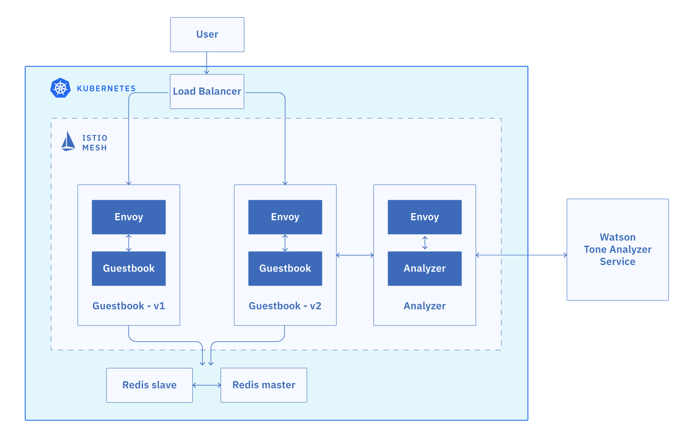
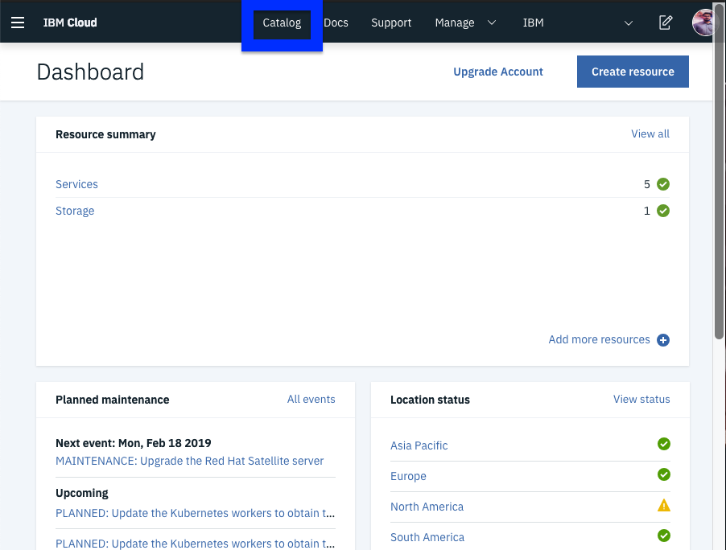
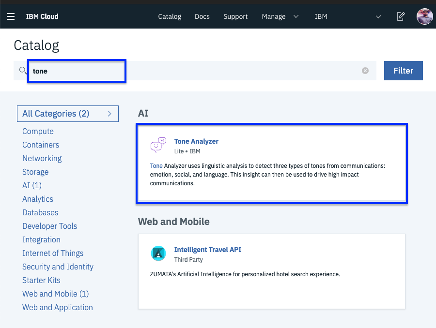
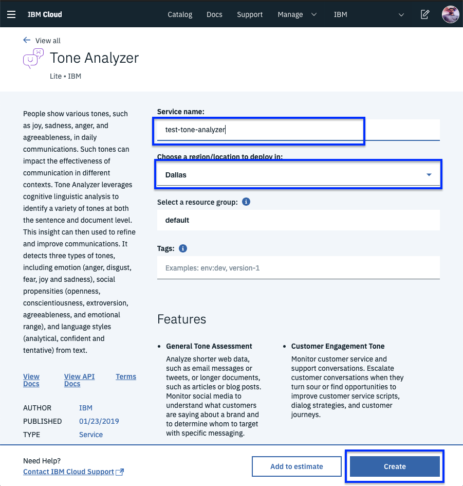
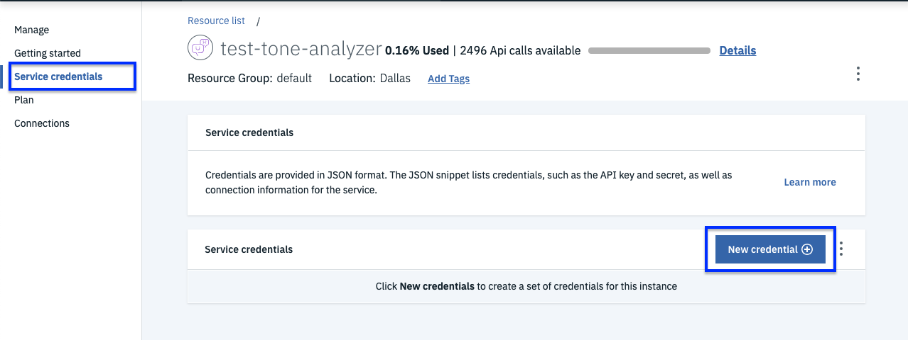
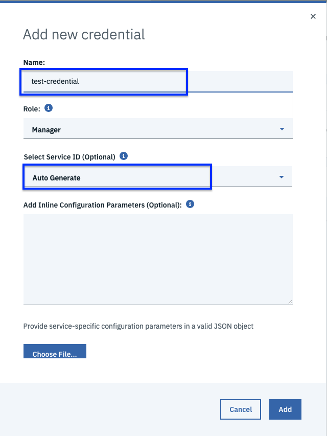
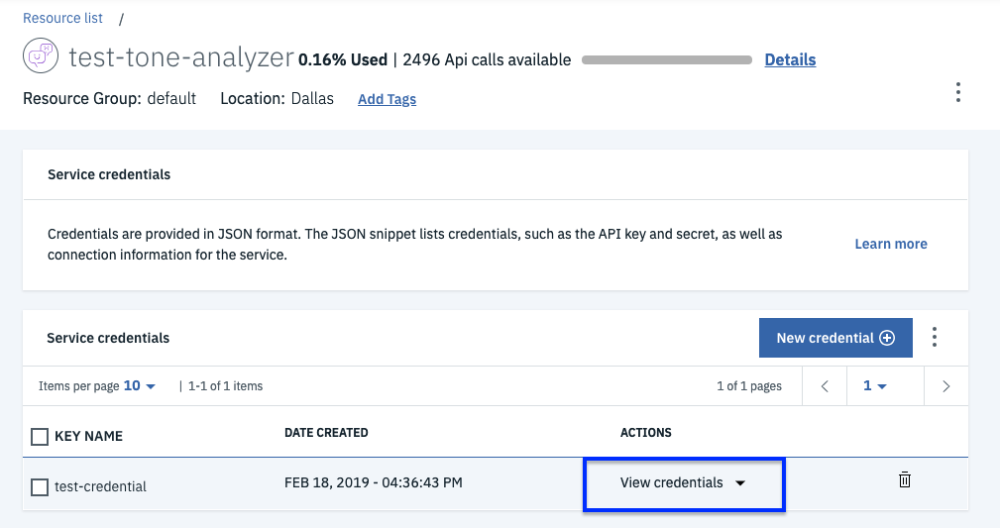
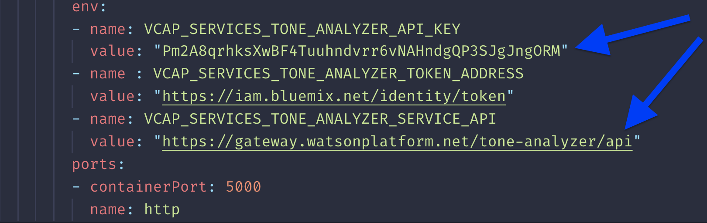

# Deploy Guestbook

The Guestbook app is a sample app for users to leave comments. It consists of a web front end, Redis master for storage, and a replicated set of Redis slaves. We will also integrate the app with Watson Tone Analyzer that detects the sentiment in users' comments and replies with emoticons. Here are the steps to deploy the app on your Kubernetes cluster:



## Clone the repository

In this step, we'll clone the istio101 and guestbook repository. Istio101 holds istio related yaml files. Guestbook is the application we will deploy.

```bash
git clone https://github.com/IBM/istio101.git
```

```bash
git clone https://github.com/IBM/guestbook.git
```

### Navigate to Guestbook app

1. Navigate into the app directory. 

```text
cd guestbook/v2
```

### Create a Redis database

The Redis database is a service that you can use to persist the data of your app. The Redis database comes with a master and slave modules.

1. Create the Redis controllers and services for both the master and the slave.

   ```text
    kubectl create -f redis-master-deployment.yaml
    kubectl create -f redis-master-service.yaml
    kubectl create -f redis-slave-deployment.yaml
    kubectl create -f redis-slave-service.yaml
   ```

2. Verify that the Redis controllers for the master and the slave are created.

   ```text
    kubectl get deployment
   ```

   Output:

   ```text
    NAME           DESIRED   CURRENT   UP-TO-DATE   AVAILABLE   AGE
    redis-master   1         1         1            1           5d
    redis-slave    2         2         2            2           5d
   ```

3. Verify that the Redis services for the master and the slave are created.

   ```text
    kubectl get svc
   ```

   Output:

   ```text
    NAME           TYPE           CLUSTER-IP      EXTERNAL-IP     PORT(S)        AGE
    redis-master   ClusterIP      172.21.85.39    <none>          6379/TCP       5d
    redis-slave    ClusterIP      172.21.205.35   <none>          6379/TCP       5d
   ```

4. Verify that the Redis pods for the master and the slave are up and running.

   ```text
    kubectl get pods
   ```

   Output:

   ```text
    NAME                            READY     STATUS    RESTARTS   AGE
    redis-master-4sswq              2/2       Running   0          5d
    redis-slave-kj8jp               2/2       Running   0          5d
    redis-slave-nslps               2/2       Running   0          5d
   ```

## Install the Guestbook app

1.  Deploy the Guestbook app on to the Kubernetes cluster.

   ```text
    kubectl apply -f ../v1/guestbook-deployment.yaml
    kubectl apply -f guestbook-deployment.yaml
   ```

2. Create the guestbook service.

   ```text
   kubectl create -f guestbook-service.yaml
   ```

3. Verify that the service was created.

   ```text
   kubectl get svc
   ```

   Output:

   ```text
    NAME           TYPE           CLUSTER-IP      EXTERNAL-IP     PORT(S)        AGE
    guestbook      LoadBalancer   172.21.36.181   169.61.37.140   80:32149/TCP   5d
   ```

   **Note: For Lite clusters, the external ip will not be available. That is expected.**

4. Verify that the pods are up and running.

   ```text
   kubectl get pods
   ```

   Output:

   ```text
    NAME                            READY     STATUS    RESTARTS   AGE
    guestbook-v1-88d7cdfb5-54sp9    2/2       Running   0          3h
    guestbook-v1-88d7cdfb5-lmnq9    2/2       Running   0          3h
    guestbook-v1-88d7cdfb5-mt2l9    2/2       Running   0          3h
    guestbook-v2-597f9cd8b6-b2jj2   2/2       Running   0          3h
    guestbook-v2-597f9cd8b6-v8vhc   2/2       Running   0          3h
    guestbook-v2-597f9cd8b6-vrmc4   2/2       Running   0          3h
    redis-master-67c878bfb4-49dkq   2/2       Running   0          3h
    redis-slave-5596f694d8-5g5tn    2/2       Running   0          3h
    redis-slave-5596f694d8-t2vd7    2/2       Running   0          3h
   ```

   Note that each guestbook pod has 2 containers in it. One is the guestbook container, and the other is the Envoy proxy sidecar.

### Use Watson Tone Analyzer

Watson Tone Analyzer detects the tone from the words that users enter into the Guestbook app. The tone is converted to the corresponding emoticons.

#### Do it via the CLI

1a. Create Watson Tone Analyzer in your account.

```text
    ibmcloud resource service-instance-create my-tone-analyzer-service tone-analyzer lite us-south
```

2a. Create the service key for the Tone Analyzer service. This command should output the credentials you just created. You will need the value for **apikey** & **url** later.

```text
    ibmcloud resource service-key-create tone-analyzer-key Manager --instance-name my-tone-analyzer-service
```

3a. If you need to get the service-keys later, you can use the following command:

```text
    ibmcloud resource service-key tone-analyzer-key
```

#### Do it from the UI

1b. Login to [IBM Cloud Account](https://github.com/moficodes/istio101/tree/287839800ef9645b7134078650fe3644c04d1128/gitbook/overview/cloud.ibm.com). Click on Catalog.



Search for tone in the search box and selct `Tone Analyzer`.



Give it a name, region should be Dallas. Click create.



2b. Create Service Key for the service. Click on `service credentials` on the left then click `New credential +`



Give the credential a name. Keep the role `Manager` for Service ID select `Auto Generate`



3b. To view the credentials. Click of View Credentials.



4 Open the `analyzer-deployment.yaml` and find the env section near the end of the file. Replace YOUR\_API\_KEY with your own API key, and replace YOUR\_URL with the url value you saved before. YOUR\_URL should look something like `https://gateway.watsonplatform.net/tone-analyzer/api`. Save the file.



5 Deploy the analyzer pods and service, using the `analyzer-deployment.yaml` and `analyzer-service.yaml` files found in the `guestbook/v2` directory. The analyzer service talks to Watson Tone Analyzer to help analyze the tone of a message.

```text
    kubectl apply -f analyzer-deployment.yaml
    kubectl apply -f analyzer-service.yaml
```

6 The analyzer service will use IBM Cloud Identity and Access management \(IAM\) tokens to make authenticated requests to the Tone Analyzer service. IAM authentication uses access tokens for authentication, which are acquired by sending a request to a url with an API key. As a result, we will need to set up egress rules to allow the analyzer service access to those external urls. Apply the egress rules found in the `istio101/workshop/plans` directory.

```text
cd ../../istio101/workshop/plans
kubectl apply -f analyzer-egress.yaml
```



```yaml
apiVersion: networking.istio.io/v1alpha3
kind: ServiceEntry
metadata:
  name: iam-watson
spec:
  hosts:
  - logs.us-south.logging.cloud.ibm.com
  - "*.cloud.ibm.com"
  - iam.bluemix.net
  - "*.watsonplatform.net"
  ports:
  - number: 443
    name: https
    protocol: HTTPS
  resolution: NONE
  location: MESH_EXTERNAL
---
apiVersion: networking.istio.io/v1alpha3
kind: VirtualService
metadata:
  name: iam-watson
spec:
  hosts:
  - iam.bluemix.net
  - "*.watsonplatform.net"
  tls:
  - match:
    - port: 443
      sni_hosts:
      - iam.bluemix.net
    route:
    - destination:
        host: iam.bluemix.net
        port:
          number: 443
      weight: 100
  - match:
    - port: 443
      sni_hosts:
      - "*.watsonplatform.net"
    route:
    - destination:
        host: "*.watsonplatform.net"
        port:
          number: 443
      weight: 100
```



  
Great! Your guestbook app is up and running. 

