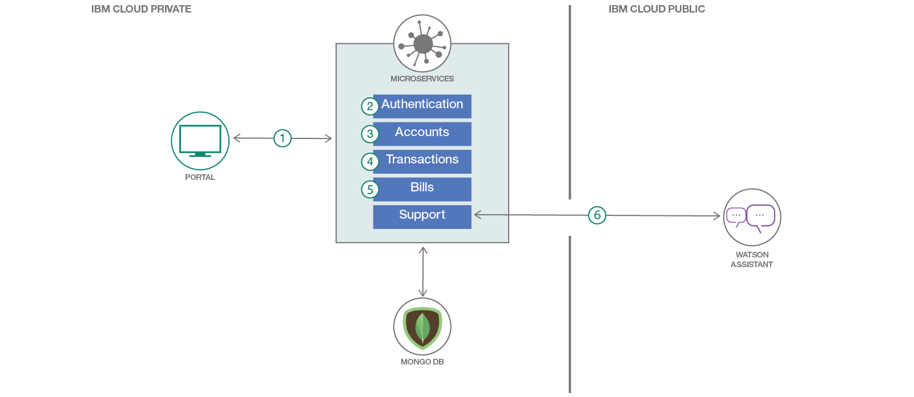

# Workshop

In this workshop, we will build and deploy a dummy digital bank composed of a set of microservices that communicate with each other. We'll be using Node.js, Express, MongoDB, and the IBM Cloud Container Service.

Development of [cloud native apps](https://www.cncf.io/blog/2017/05/15/developing-cloud-native-applications/) that are broken down into a set of [microservices](http://microservices.io/) has been praised and commended as best-practice in software development methodologies. Software stacks like [Kubernetes](https://kubernetes.io/), which enable cloud native computing, have therefore picked up quite a bit of popularity.

It’s a little _\(a lot\)_ more fun, however, to build a so-called cloud native app, than to talk about one.

### Let's get started!

We’ll take a use-case that has a bit of real-world familiarity to it — a digital bank originally inspired by [Monzo](http://monzo.com/) - Innovate.

[A live version deployed on a Kubernetes cluster in IBM Cloud is available for you to try here](http://ibm.biz/digibank). To test it out, sign up for an account. A process runs periodically to dump randomized transactions and bills for user accounts, so give it a couple of minutes and refresh to see your populated profile.

## Learning objectives

When you've completed this Code Pattern, you will understand how to:

* Break an application down to a set of microservices
* Create and manage a Kubernetes cluster on IBM Cloud
* Deploy to a Kubernetes cluster on IBM Cloud
* Deploy to IBM Cloud Private

## Flow

When thinking of business capabilities, our imaginary bank will need the following set of microservices:

1. _Portal:_ Loads the UI and takes care of user sessions and relies on all other microservices for core functionality.
2. _Authentication:_ Handles user profile creation, as well as login & logout.
3. _Accounts:_ Handles creation, management, and retrieval of a user’s banking accounts.
4. _Transactions:_ Handles creation and retrieval of transactions made against users' bank accounts.
5. _Bills:_ Handles creation, payment, and retrieval of bills.
6. _Support:_ Handles communication with Watson Assistant to enable a support chat feature.

