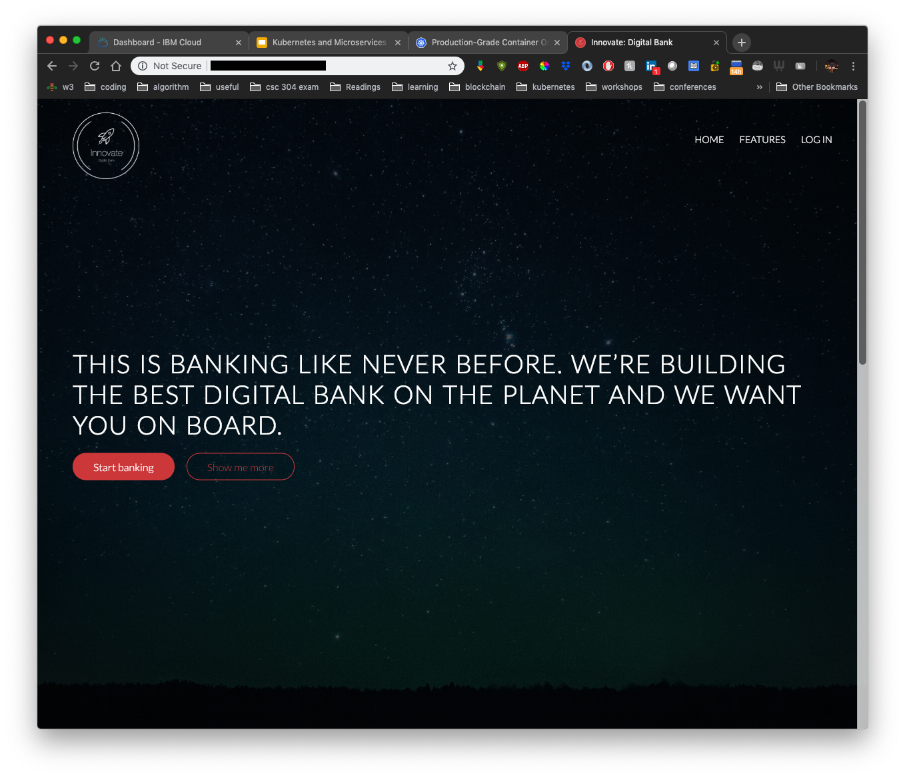

# Access Your Application

### Find your cluster's Public IP

Run the following command to get a list of the worker nodes that are in your cluster.

```bash
$ kubectl get nodes

NAME             STATUS    ROLES     AGE       VERSION
10.176.239.180   Ready     <none>    2d        v1.11.6+IKS
10.176.239.182   Ready     <none>    2d        v1.11.6+IKS
10.177.184.153   Ready     <none>    2d        v1.11.6+IKS
```

Pick any of the nodes and use the `kubectl describe` command. We'll use `grep` to find just the External IP portion:

```bash
$ kubectl describe nodes 10.176.239.180 | grep ExternalIP

ExternalIP:  <YOUR-IP>
```

This is the IP used to access your cluster. We also need to append the port where our portal service is listening. In the previous step, you may have noticed that the portal is listening on external port 30060:

```bash
$ kubectl get svc
NAME                      TYPE        CLUSTER-IP       EXTERNAL-IP   PORT(S)          AGE
...
innovate-portal           NodePort    172.21.236.41    <none>        3100:30060/TCP   1h
...
```

Open any browser. Go to `<YOUR-IP>:30060`

You should see the Innovate Digital Bank landing page!



## You're done with the Workshop!

Congratulations! You've completed the first part of the Innovate Digital Bank Kubernetes workshop. Let's summarize what you've done:

1. Installed `kubectl`, `helm`, and `ibmcloud` tooling.
2. Obtained and setup access to a Kubernetes cluster on IBM Cloud
3. Installed Tiller \(Helm's server side component\) on your cluster
4. Deployed Innovate Digital Bank to the cluster using Helm charts
5. Accessed the application using the Public IP and port

## Extra Credit Steps

If you'd like to keep hacking, we have a additional workshop material where you'll take a step back to build the microservices that power the Innovate Digital Bank application. You'll build the Docker containers from source code on your machine, push them to a registry, edit your Helm charts to access your custom images and deploy them to your cluster. In the next part of this workshop, you'll mimic a standard DevOps flow for working with microservices on Kubernetes.


