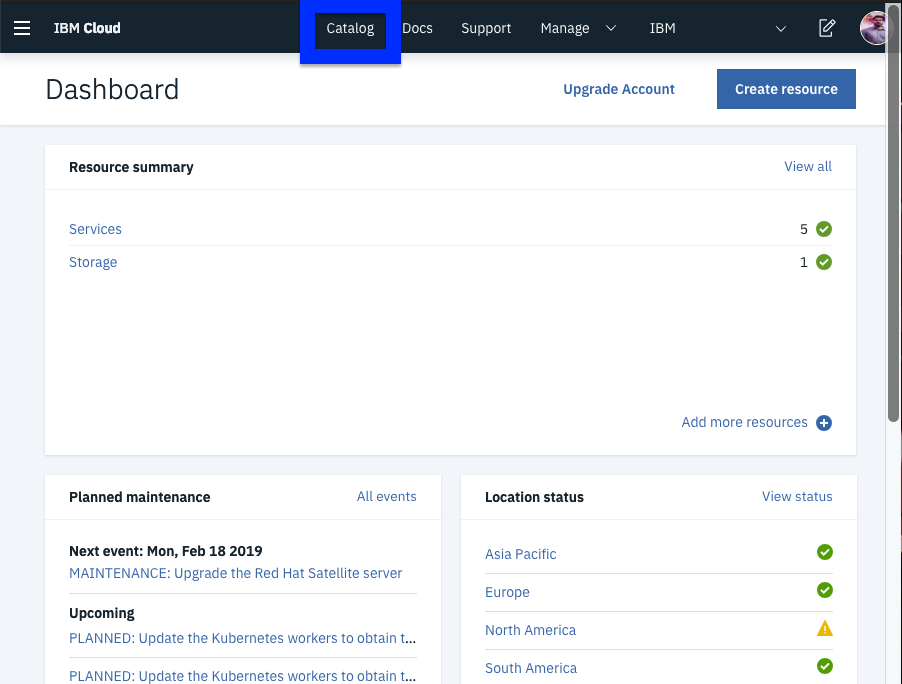
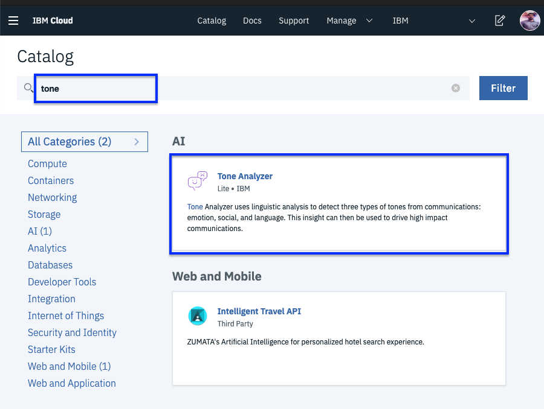
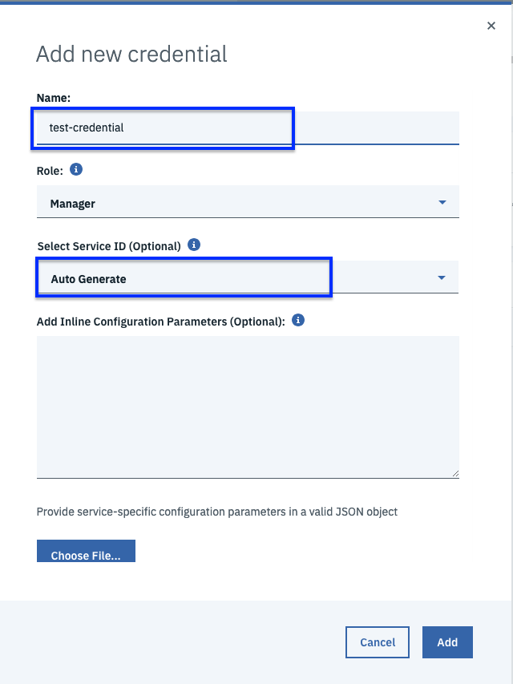
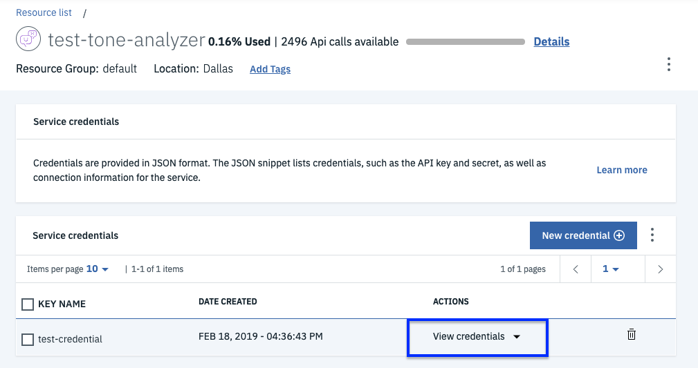

# Exercise 3 - Deploy the Guestbook app with Istio Proxy

The Guestbook app is a sample app for users to leave comments. It consists of a web front end, Redis master for storage, and a replicated set of Redis slaves. We will also integrate the app with Watson Tone Analyzer that detects the sentiment in users' comments and replies with emoticons. Here are the steps to deploy the app on your Kubernetes cluster:

### Download the Guestbook app

1. If you haven't already on the setup steps, clone the guestbook repository.

    ```shell
    git clone https://github.com/IBM/guestbook.git
    ```

2. Navigate into the app directory.

    ```shell
    cd guestbook/v2
    ```

### Create a Redis database

The Redis database is a service that you can use to persist the data of your app. The Redis database comes with a master and slave modules.

1. Create the Redis controllers and services for both the master and the slave.

    ``` shell
    kubectl create -f redis-master-deployment.yaml
    kubectl create -f redis-master-service.yaml
    kubectl create -f redis-slave-deployment.yaml
    kubectl create -f redis-slave-service.yaml
    ```

2. Verify that the Redis controllers for the master and the slave are created.

    ```shell
    kubectl get deployment
    ```

    Output:

    ```shell
    NAME           DESIRED   CURRENT   UP-TO-DATE   AVAILABLE   AGE
    redis-master   1         1         1            1           5d
    redis-slave    2         2         2            2           5d
    ```

3. Verify that the Redis services for the master and the slave are created.

    ```shell
    kubectl get svc
    ```

    Output:
    ```shell
    NAME           TYPE           CLUSTER-IP      EXTERNAL-IP     PORT(S)        AGE
    redis-master   ClusterIP      172.21.85.39    <none>          6379/TCP       5d
    redis-slave    ClusterIP      172.21.205.35   <none>          6379/TCP       5d
    ```

4. Verify that the Redis pods for the master and the slave are up and running.

    ```shell
    kubectl get pods
    ```
    Output:
    ```shell
    NAME                            READY     STATUS    RESTARTS   AGE
    redis-master-4sswq              2/2       Running   0          5d
    redis-slave-kj8jp               2/2       Running   0          5d
    redis-slave-nslps               2/2       Running   0          5d
    ```

## Sidecar injection

In Kubernetes, a sidecar is a utility container in the pod, and its purpose is to support the main container. For Istio to work, Envoy proxies must be deployed as sidecars to each pod of the deployment. There are two ways of injecting the Istio sidecar into a pod: manually using the istioctl CLI tool or automatically using the Istio Initializer. If we followed step 9 in the Setup Steps we should have automatic sidecar injection enabled already. If not we can always inject the sidecar manually.

## Install the Guestbook app with manual sidecar injection

1. Inject the Istio Envoy sidecar into the guestbook pods, and deploy the Guestbook app on to the Kubernetes cluster.

    ```shell
    kubectl apply -f <(istioctl kube-inject -f ../v1/guestbook-deployment.yaml)
    kubectl apply -f <(istioctl kube-inject -f guestbook-deployment.yaml)
    ```

These commands will inject the Istio Envoy sidecar into the guestbook pods, as well as deploy the Guestbook app on to the Kubernetes cluster. Here we have two versions of deployments, a new version (`v2`) in the current directory, and a previous version (`v1`) in a sibling directory. They will be used in future sections to showcase the Istio traffic routing capabilities.

2. Create the guestbook service.

    ```shell
    kubectl create -f guestbook-service.yaml
    ```

3. Verify that the service was created.

    ```shell
    kubectl get svc
    ```
    Output:
    ```shell
    NAME           TYPE           CLUSTER-IP      EXTERNAL-IP     PORT(S)        AGE
    guestbook      LoadBalancer   172.21.36.181   169.61.37.140   80:32149/TCP   5d
    ```

    **Note: For Lite clusters, the external ip will not be available. That is expected.**

4. Verify that the pods are up and running.

    ```shell
    kubectl get pods
    ```
    Output:
    ```shell
    NAME                            READY     STATUS    RESTARTS   AGE
    guestbook-v1-88d7cdfb5-54sp9    2/2       Running   0          3h
    guestbook-v1-88d7cdfb5-lmnq9    2/2       Running   0          3h
    guestbook-v1-88d7cdfb5-mt2l9    2/2       Running   0          3h
    guestbook-v2-597f9cd8b6-b2jj2   2/2       Running   0          3h
    guestbook-v2-597f9cd8b6-v8vhc   2/2       Running   0          3h
    guestbook-v2-597f9cd8b6-vrmc4   2/2       Running   0          3h
    redis-master-67c878bfb4-49dkq   2/2       Running   0          3h
    redis-slave-5596f694d8-5g5tn    2/2       Running   0          3h
    redis-slave-5596f694d8-t2vd7    2/2       Running   0          3h
    ```

    Note that each guestbook pod has 2 containers in it. One is the guestbook container, and the other is the Envoy proxy sidecar.

### Use Watson Tone Analyzer
Watson Tone Analyzer detects the tone from the words that users enter into the Guestbook app. The tone is converted to the corresponding emoticons.

#### Do it via the CLI

1a. Create Watson Tone Analyzer in your account.

    ```shell
    ibmcloud resource service-instance-create my-tone-analyzer-service tone-analyzer lite us-south
    ```

2a. Create the service key for the Tone Analyzer service. This command should output the credentials you just created. You will need the value for **apikey** & **url** later.

    ```shell
    ibmcloud resource service-key-create tone-analyzer-key Manager --instance-name my-tone-analyzer-service
    ```

3a. If you need to get the service-keys later, you can use the following command:

    ```shell
    ibmcloud resource service-key tone-analyzer-key
    ```


#### Do it from the UI

1b. Login to [IBM Cloud Account](cloud.ibm.com). 
Click on Catalog.



Search for tone in the search box and selct `Tone Analyzer`.



Give it a name, region should be Dallas. Click create.

  

2b. Create Service Key for the service.
Click on `service credentials` on the left then click `New credential +`


Give the credential a name. Keep the role `Manager` for Service ID select `Auto Generate`



3b. To view the credentials. 
Click of View Credentials.



4. Open the `analyzer-deployment.yaml` and find the env section near the end of the file. Replace YOUR_API_KEY with your own API key, and replace YOUR_URL with the url value you saved before. YOUR_URL should look something like `https://gateway.watsonplatform.net/tone-analyzer/api`. Save the file.


5. Deploy the analyzer pods and service, using the `analyzer-deployment.yaml` and `analyzer-service.yaml` files found in the `guestbook/v2` directory. The analyzer service talks to Watson Tone Analyzer to help analyze the tone of a message.

    ```shell
    kubectl apply -f <(istioctl kube-inject -f analyzer-deployment.yaml)
    kubectl apply -f analyzer-service.yaml
    ```
    
6. The analyzer service will use IBM Cloud Identity and Access management (IAM) tokens to make authenticated requests to the Tone Analyzer service. IAM authentication uses access tokens for authentication, which are acquired by sending a request to a url with an API key. As a result, we will need to set up egress rules to allow the analyzer service access to those external urls. Apply the egress rules found in the `istio101/workshop/plans` directory.

    ```shell
    cd ../../istio101/workshop/plans
    kubectl apply -f analyzer-egress.yaml
    ```

Great! Your guestbook app is up and running. In Exercise 4, you'll be able to see the app in action by directly accessing the service endpoint. You'll also be able to view Telemetry data for the app.