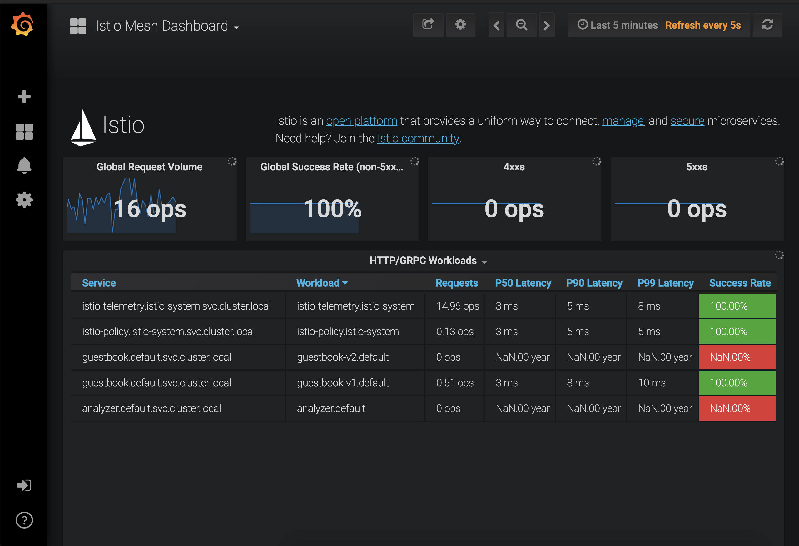
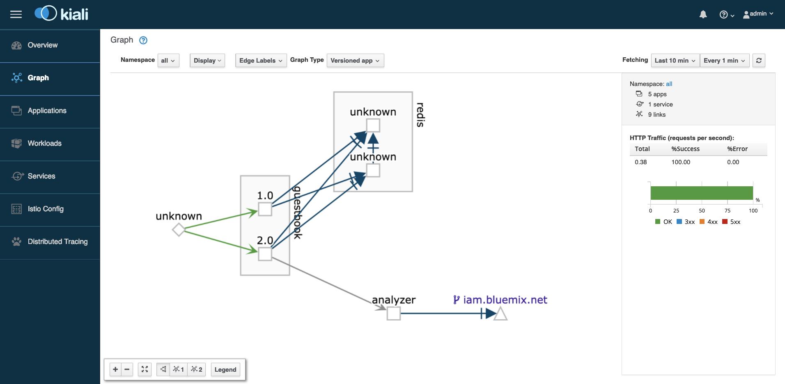

# Metrics and Tracing

### Challenges with microservices

We all know that microservice architecture is the perfect fit for cloud native applications and it increases the delivery velocities greatly. Envision you have many microservices that are delivered by multiple teams, how do you observe the the overall platform and each of the service to find out exactly what is going on with each of the services? When something goes wrong, how do you know which service or which communication among the few services are causing the problem?

### Istio telemetry

Istio's tracing and metrics features are designed to provide broad and granular insight into the health of all services. Istio's role as a service mesh makes it the ideal data source for observability information, particularly in a microservices environment. As requests pass through multiple services, identifying performance bottlenecks becomes increasingly difficult using traditional debugging techniques. Distributed tracing provides a holistic view of requests transiting through multiple services, allowing for immediate identification of latency issues. With Istio, distributed tracing comes by default. This will expose latency, retry, and failure information for each hop in a request.

You can read more about how [Istio mixer enables telemetry reporting](https://istio.io/docs/concepts/policy-and-control/mixer.html).

### Configure Istio to receive telemetry data

1. Verify that the Grafana, Prometheus, ServiceGraph and Jaeger add-ons were installed successfully. All add-ons are installed into the `istio-system` namespace.

   ```text
    kubectl get pods -n istio-system
    kubectl get services -n istio-system
   ```

2. Configure Istio to automatically gather telemetry data for services that run in the service mesh.

   a. Create a rule to collect telemetry data.

   ```text
    kubectl create -f guestbook-telemetry.yaml
   ```

3. Obtain the guestbook endpoint to access the guestbook.

   For a standard cluster, you can access the guestbook via the external IP for your service as guestbook is deployed as a load balancer service. Get the EXTERNAL-IP of the guestbook service via output below:

   ```text
    kubectl get service guestbook -n default
   ```

   ```bash
   export GUESTBOOK_URL=$(kl get svc guestbook -o=jsonpath='{.status.loadBalancer.ingress[0].ip}')
   ```

4.  Go to this external ip address in the browser to try out your guestbook.


5. Generate a small load to the app.

```text
 for i in {1..50}; do sleep 0.5; curl -s $GUESTBOOK_URL | grep "<title>" ; done
```

We did a grep on the `<title>` from the curl response to show that the loadbalancer was sending the traffic to both `v1` and `v2` of the app.

## View guestbook telemetry data

### Jaeger

1. Establish port forwarding from local port 16686 to the Tracing instance:

   ```text
    kubectl port-forward -n istio-system \
      $(kubectl get pod -n istio-system -l app=jaeger -o jsonpath='{.items[0].metadata.name}') \
      16686:16686
   ```

2. In your browser, go to `http://127.0.0.1:16686`


1. From the **Services** menu, select either the **guestbook** or **analyzer** service.
2. Scroll to the bottom and click on **Find Traces** button to see traces.


1. ctrl-c on the terminal when you are done looking at the traces.

### Grafana

1. Establish port forwarding from local port 3000 to the Grafana instance:

   ```text
    kubectl -n istio-system port-forward \
      $(kubectl -n istio-system get pod -l app=grafana -o jsonpath='{.items[0].metadata.name}') \
      3000:3000
   ```

2. Browse to [http://localhost:3000](http://localhost:3000) and navigate to the Istio Mesh Dashboard by clicking on the Home menu on the top left.



1. ctrl-c on the terminal when you are done looking at the graph.

### Prometheus

1. Establish port forwarding from local port 9090 to the Prometheus instance.

   ```text
    kubectl -n istio-system port-forward \
      $(kubectl -n istio-system get pod -l app=prometheus -o jsonpath='{.items[0].metadata.name}') \
      9090:9090
   ```

2. Browse to [http://localhost:9090/graph](http://localhost:9090/graph), and in the “Expression” input box, enter: `istio_request_bytes_count`. Click Execute.


1. ctrl-c on the terminal when you are done looking at the logs.

### Service Graph

1. Establish port forwarding from local port 8088 to the Service Graph instance:

   ```text
    kubectl -n istio-system port-forward \
      $(kubectl -n istio-system get pod -l app=servicegraph -o jsonpath='{.items[0].metadata.name}') \
      8088:8088
   ```

2. Browse to [http://localhost:8088/dotviz](http://localhost:8088/dotviz)


### Kiali

Kiali is an open-source project that installs on top of Istio to visualize your service mesh. It provides deeper insight into how your microservices interact with one another, and provides features such as circuit breakers and request rates for your services.

1. To get started with Kiali, you'll need to install it to your cluster. Run the full script below:

   ```text
    JAEGER_URL="http://jaeger-query-istio-system.127.0.0.1.nip.io"
    GRAFANA_URL="http://grafana-istio-system.127.0.0.1.nip.io"
    VERSION_LABEL="v0.10.0"

    curl https://raw.githubusercontent.com/kiali/kiali/${VERSION_LABEL}/deploy/kubernetes/kiali-configmap.yaml | \
    VERSION_LABEL=${VERSION_LABEL} \
    JAEGER_URL=${JAEGER_URL}  \
    ISTIO_NAMESPACE=istio-system  \
    GRAFANA_URL=${GRAFANA_URL} envsubst | kubectl create -n istio-system -f -

    curl https://raw.githubusercontent.com/kiali/kiali/${VERSION_LABEL}/deploy/kubernetes/kiali-secrets.yaml | \
    VERSION_LABEL=${VERSION_LABEL} envsubst | kubectl create -n istio-system -f -

    curl https://raw.githubusercontent.com/kiali/kiali/${VERSION_LABEL}/deploy/kubernetes/kiali.yaml | \
    VERSION_LABEL=${VERSION_LABEL}  \
    IMAGE_NAME=kiali/kiali \
    IMAGE_VERSION=${VERSION_LABEL}  \
    NAMESPACE=istio-system  \
    VERBOSE_MODE=4  \
    IMAGE_PULL_POLICY_TOKEN="imagePullPolicy: Always" envsubst | kubectl create -n istio-system -f -
   ```

> For mac users when the above commands are run you could see an error for `envsubst`. [This Stackoverflow Thread](https://stackoverflow.com/a/23622446/10272405) should solve the problem.

1. Establish port forwarding from local port 8084.

   ```text
    kubectl -n istio-system port-forward \
     $(kubectl -n istio-system get pod -l app=kiali -o jsonpath='{.items[0].metadata.name}') \
     8084:20001
   ```

2. Go to [http://localhost:8084](http://localhost:8084) to access kiali dashboard. Use admin/admin as username and password.
3. Click the "Graph" tab on the left side to see the a visual service graph of the various services in your Istio mesh. You can see request rates as well by clicking the "Edge Labels" tab and choosing "Traffic rate per second".



4. On the terminal ctrl-c to close connection.

## Understand what happened

Although Istio proxies are able to automatically send spans, they need some hints to tie together the entire trace. Apps need to propagate the appropriate HTTP headers so that when the proxies send span information to Zipkin or Jaeger, the spans can be correlated correctly into a single trace.

In the example, when a user visits the Guestbook app, the HTTP request is sent from the guestbook service to Watson Tone Analyzer. In order for the individual spans of guestbook service and Watson Tone Analyzer to be tied together, we have modified the guestbook service to extract the required headers \(x-request-id, x-b3-traceid, x-b3-spanid, x-b3-parentspanid, x-b3-sampled, x-b3-flags, x-ot-span-context\) and forward them onto the analyzer service when calling the analyzer service from the guestbook service. The change is in the `v2/guestbook/main.go`. By using the `getForwardHeaders()` method, we are able to extract the required headers, and then we use the required headers further when calling the analyzer service via the `getPrimaryTone()` method.

## Questions

1. Does a user need to modify their app to get metrics for their apps? A: 1. Yes 2. No. \(2 is correct\)
2. Does a user need to modify their app to get distributed tracing for their app to work properly? A: 1. Yes 2. No. \(1 is correct\)
3. What distributed tracing system does Istio support by default? A: 1. Zipkin 2. Kibana 3. LogStash 4. Jaeger. \(1 and 4 are correct\)

