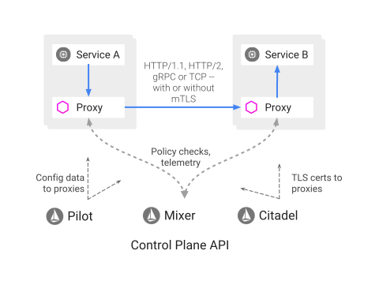

# Exercise 2 - Installing Istio on IBM Cloud Kubernetes Service
In this module, you download and install Istio.

1.  Either download Istio directly from [https://github.com/istio/istio/releases](https://github.com/istio/istio/releases) or get the latest version by using curl:

```shell
curl -L https://git.io/getLatestIstio | sh -
```

2. Extract the installation files, if the script doesn't do it for you.

```shell
tar -xvzf istio-<istio-version>-linux.tar.gz
```

3. Add the `istioctl` client to your PATH. The `<version-number>` is in the directory name. For example, run the following command on a MacOS or Linux system:

```shell
export PATH=$PWD/istio-<version-number>/bin:$PATH
```

4. Change the directory to the Istio file location.

5. Now let's install Istio into the `istio-system` namespace in your Kubernetes cluster:

```shell
kubectl apply -f $PWD/<istio-installation>/install/kubernetes/istio-demo.yaml
```

6. Ensure that the `istio-*` Kubernetes services are deployed before you continue.

```shell
kubectl get svc -n istio-system
```

```shell
NAME                       CLUSTER-IP       EXTERNAL-IP   PORT(S)                                                               AGE
grafana                    172.22.xxx.xxx   <none>        3000/TCP                                                              4d
istio-citadel              172.22.xxx.xxx   <none>        8060/TCP,9093/TCP                                                     1m
istio-egressgateway        172.22.xxx.xxx   <none>        80/TCP,443/TCP                                                        1m
istio-ingressgateway       172.22.xxx.xxx   <pending>     80:31380/TCP,443:31390/TCP,31400:31400/TCP                            1m
istio-pilot                172.22.xxx.xxx   <none>        15003/TCP,15005/TCP,15007/TCP,15010/TCP,15011/TCP,8080/TCP,9093/TCP   1m
istio-policy               172.22.xxx.xxx   <none>        9091/TCP,15004/TCP,9093/TCP                                           1m
istio-sidecar-injector     172.22.xxx.xxx   <none>        443/TCP                                                               1m
istio-statsd-prom-bridge   172.22.xxx.xxx   <none>        9102/TCP,9125/UDP                                                     1m
istio-telemetry            172.22.xxx.xxx   <none>        9091/TCP,15004/TCP,9093/TCP,42422/TCP                                 1m
prometheus                 172.22.xxx.xxx   <none>        9090/TCP                                                              1m
servicegraph               172.22.xxx.xxx   <none>        8088/TCP                                                              1m
tracing                    172.22.xxx.xxx   <pending>     80:30132/TCP                                                          1m
zipkin                     172.22.xxx.xxx   <none>        9411/TCP                                                              1m
```

  **Note: For Lite clusters, the istio-ingressgateway service will be in `pending` state with no external ip. That is normal.**

7. Ensure the corresponding pods `istio-citadel-*`, `istio-ingressgateway-*`, `istio-pilot-*`, and `istio-policy-*` are all in **`Running`** state before you continue.

```shell
kubectl get pods -n istio-system
```

```shell
NAME                                        READY     STATUS    RESTARTS   AGE
grafana-cd99bf478-kpwnk                     1/1       Running   0          1m
istio-citadel-ff5696f6f-5pw9p               1/1       Running   0          1m
istio-egressgateway-58d98d898c-d42f4        1/1       Running   0          1m
istio-ingressgateway-6bc7c7c4bc-f78xr       1/1       Running   0          1m
istio-pilot-6c5c6b586c-dv7fs                2/2       Running   0          1m
istio-policy-5c7fbb4b9f-pj6zz               2/2       Running   0          1m
istio-sidecar-injector-dbd67c88d-ds9xn      1/1       Running   0          1m
istio-statsd-prom-bridge-6dbb7dcc7f-9z6h5   1/1       Running   0          1m
istio-telemetry-54b5bf4847-gmgxt            2/2       Running   0          1m
istio-tracing-67dbb5b89f-lwmzf              1/1       Running   0          1m
prometheus-586d95b8d9-hqfn6                 1/1       Running   0          1m
servicegraph-6d86dfc6cb-hprh2               1/1       Running   0          1m
```

Before your continue, make sure all the pods are deployed and **`Running`**. If they're in `pending` state, wait a few minutes to let the deployment finish.

Congratulations! You successfully installed Istio into your cluster.


## Validating Installation

In this exercise, you will validate your Istio installation and launch some debugging containers to experiment with the service mesh.


## Service Mesh Sidecar



Istio's core functionality is achieved by setting up a proxy, or sidecar, inside every kubernetes pod. Outgoing and incoming traffic bound for the pod is intercepted by iptables and delivered to the [envoy](https://www.envoyproxy.io/) daemon running in the sidecar. The `envoy` proxy can then inspect, modify, forward, and record all traffic used by the application. East-West traffic goes through two `envoy` proxies, one at source and one at destination. All `envoy` proxies are configured by [`pilot`](https://istio.io/docs/reference/commands/pilot-agent/), an Istio component. Other major Istio components are [citadel](https://istio.io/docs/concepts/security/#authentication-architecture) which manages mTLS, [telemetry](https://istio.io/docs/tasks/telemetry/) which collects information on microservice cross-chatter, and [policy](https://istio.io/docs/concepts/policies-and-telemetry/) which defines and enforces network communication policies.

## Sidecar injection

In Kubernetes, a sidecar is a utility container in the pod, and its purpose is to support the main container. For Istio to work, Envoy proxies must be deployed as sidecars to each pod of the deployment. There are two ways of injecting the Istio sidecar into a pod: manually using istioctl CLI tool or automatically using the Istio Initializer. In a previous step, we set up our cluster to use automatic injection.

## Terminals

In the upcoming exercises, it is useful to have multiple terminals open. Each will need the `KUBECONFIG` environment variable you exported earlier in the tutorial. If you get errors like:

```shell
kubectl get pod
The connection to the server localhost:8080 was refused - did you specify the right host or port?
```

Go back and export that environment variable and try again.


### Launch a debug container

```shell
kubectl apply -f <(istioctl kube-inject -f poke-pod.yaml)
```

This container is running with plenty of utilities. A great way to debug issues in your cluster. 

```shell
kubectl get pod
NAME                     READY     STATUS        RESTARTS   AGE
poke-pod                 2/2       Running       0          35m
```

Note that the pod is running, and that it has a `2/2` for containers. That's the sidecar!

Lets dig deeper:

```shell
kubectl describe pod/poke-pod
```

There is a ton of output in here! Note that we have an `init-container` referenced, an `init-container` is a contianer that runs before the main application comes up. This is used all over Kubernetes. It's a great place to just run a little intializer script or do other setup work. In this case the `init-container` runs a script that runs a bunch of `iptables` commands that reroute all network traffic through the sidecar. You can view the logs of that like this:

```shell
kubectl logs poke-pod -c istio-init
```

You can see all the `iptables` magic there. Also note that when we have more than one container in the pod, we have to use the `-c` flag to specify which contianer we're refering to.

Further down the `describe` output, we can see that there is a long running sidecar container called `istio-proxy`. We can see in the args to the container what kind of configuration information it has. There is more digging to do here, but let's move on.


### See the proxy in action

Create an nginx service

```shell
kubectl apply -f <(istioctl kube-inject -f nginx.yaml)
```

And inspect

```
kubectl get pod
NAME                     READY     STATUS    RESTARTS   AGE
nginx-645dbd8899-mwnsc   2/2       Running   0          4s
poke-pod                 2/2       Running   0          52m
```

```shell
kubectl describe pod/nginx-645dbd8899-mwnsc
```

This looks pretty much like the other pod. Both an `init-container` and an `istio-proxy` sidecar container are present.

Now, lets see the traffic moving between pods via the proxy mesh.

In one terminal, start watching logs on the nginx's istio sidecar.

```shell
kubectl logs nginx-645dbd8899-mwnsc -c istio-proxy -f
```
> Note, your exact pod name will be different.

In another terminal, exec into the poke container and make some requests.

```shell
kubectl exec -it poke-pod /bin/bash -c poke-pod
curl nginx
curl nginx
curl nginx:3000
```

In your logs terminal, you should be seeing the requests filter through that `envoy` process.

```
[2018-08-20T05:10:27.314Z] "GET / HTTP/1.1" 200 - 0 612 5 0 "-" "curl/7.47.0" "9891a5fe-910b-912c-978b-2ead37c27528" "nginx" "127.0.0.1:80"
[2018-08-20T05:10:54.802Z] "GET / HTTP/1.1" 200 - 0 612 0 0 "-" "curl/7.47.0" "61fb9a7f-c0bf-9e01-bd01-2b23ba0fe088" "nginx" "127.0.0.1:80"
```

You can find all 3 hops of the request in the logs. First at the sidecar in the source pod, then at the sidecar in the destination pod (that's what we just looked at), and finally in the application logs inside the destination pod.


You've now done some basic Istio poking, and hopefully have a deeper understanding of what is going on when we use Istio as a service mesh.

### Delete validation pods

```shell
kubectl delete pod/poke-pod
kubectl delete deployment/nginx
```


#### [Continue to Exercise 3 - Deploy Guestbook with Istio Proxy](../exercise-3/README.md)
