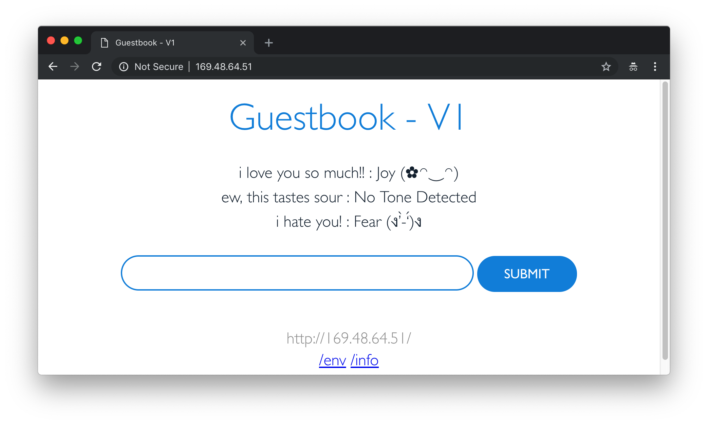
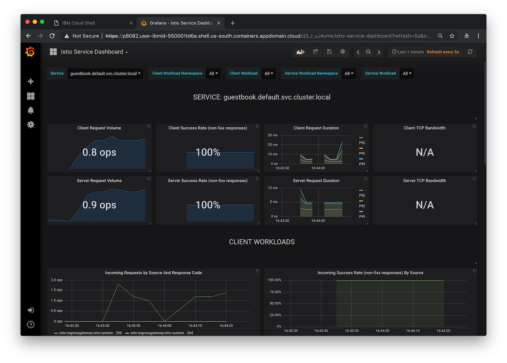
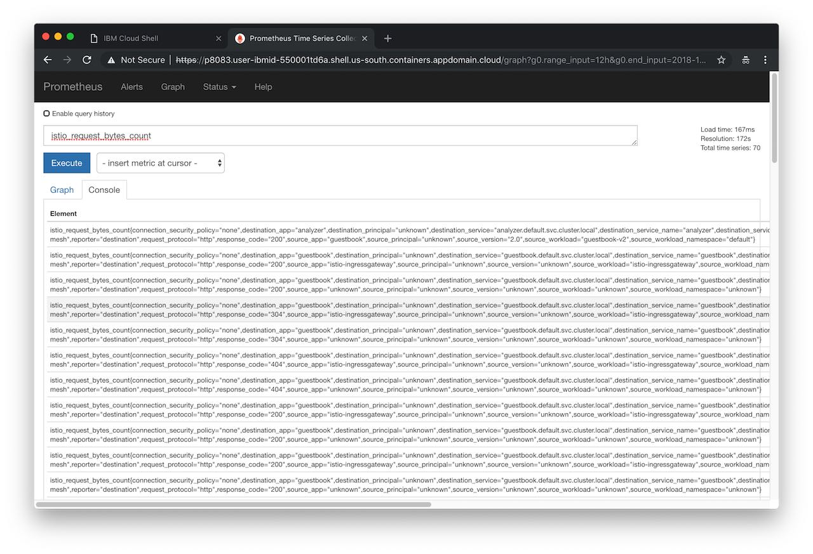
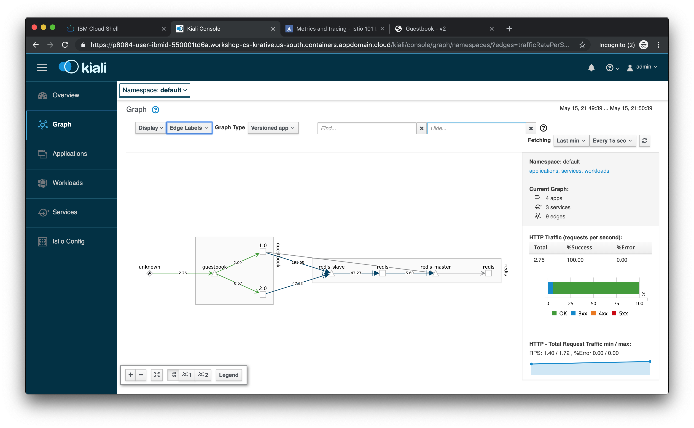

# Exercise 4 - Observe service telemetry: metrics and tracing

## Challenges with microservices

We all know that microservice architecture is the perfect fit for cloud native applications and it increases the delivery velocities greatly. Envision you have many microservices that are delivered by multiple teams, how do you observe the the overall platform and each of the service to find out exactly what is going on with each of the services?  When something goes wrong, how do you know which service or which communication among the few services are causing the problem?

## Istio telemetry

Istio's tracing and metrics features are designed to provide broad and granular insight into the health of all services. Istio's role as a service mesh makes it the ideal data source for observability information, particularly in a microservices environment. As requests pass through multiple services, identifying performance bottlenecks becomes increasingly difficult using traditional debugging techniques. Distributed tracing provides a holistic view of requests transiting through multiple services, allowing for immediate identification of latency issues. With Istio, distributed tracing comes by default. This will expose latency, retry, and failure information for each hop in a request.

You can read more about how [Istio mixer enables telemetry reporting](https://istio.io/docs/concepts/policy-and-control/mixer.html).

### Configure Istio to receive telemetry data

1. Enable Istio monitoring dashboards, by running these two commands:

   ```shell
   kubectl patch cm managed-istio-custom -n ibm-operators --type='json' -p='[{"op": "add", "path": "/data/istio-monitoring", "value":"true"}]'
   ```

   ```shell
   kubectl annotate iop -n ibm-operators managed-istio --overwrite version="custom-applied-at: $(date)"
   ```

1. Verify that the Grafana, Prometheus, Kiali and Jaeger add-ons were installed successfully. All add-ons are installed into the `istio-system` namespace.

    ```shell
    kubectl get services -n istio-system
    ```

1. Obtain the guestbook endpoint to access the guestbook.

    You can access the guestbook via the external IP for your service as guestbook is deployed as a load balancer service. Get the EXTERNAL-IP of the guestbook service via output below:

    ```shell
    kubectl get service guestbook -n default
    ```

    Go to this external ip address in the browser to try out your guestbook. This service will route you to either v1 or v2, at random. If you wish to see a different version, you'll need to do a hard refresh (`cmd + shift + r` on a mac, or `ctrl + f5` on a PC). Alternatively, you can `curl` the address.



1. Generate a small load to the app, replacing guestbook_IP with the EXTERNAL-IP.

    ```shell
    for i in {1..40}; do sleep 0.2; curl -I http://<guestbook_IP>/; done
    ```

## View guestbook telemetry data

### Jaeger

1. Launch the Jaeger dashboard:

    ```shell
    istioctl dashboard jaeger
    ```

1. From the **Services** menu, select either the **guestbook** or **analyzer** service.
1. Scroll to the bottom and click on **Find Traces** button to see traces.
1. Use Ctrl-C in the terminal to exit the port-foward when you are done.

Read more about [Jaeger](https://www.jaegertracing.io/docs/)

### Grafana

1. Create a secret which will be used to set the login credentials for Grafana

```shell
cat <<EOF | kubectl apply -f -
apiVersion: v1
kind: Secret
metadata:
  name: grafana
  namespace: istio-system
type: Opaque
data:
  username: "YWRtaW4="
  passphrase: "YWRtaW4="
EOF
```

1. Wait 2 minutes for the secret to be picked up and then launch the dashboard:

    ```shell
    istioctl dashboard grafana
    ```



1. Log in using `admin` for both username and password.
1. Navigate to the `Istio Service Dashboard` by clicking on the Home menu on the top left, then Istio, then Istio Service Dashboard.

1. Select guestbook in the Service drop down.

1. In a different tab, visit the guestbook application and refresh the page multiple times to generate some load, or run the load script you used previously. Switch back to the Grafana tab.

1. Use Ctrl-C in the terminal to exit the port-foward when you are done.

This Grafana dashboard provides metrics for each workload. Explore the other dashboard provided as well.

Read more about [Grafana](http://docs.grafana.org/).

### Prometheus

1. Establish port forwarding from local port 9090 to the Prometheus instance.

    ```shell
    istioctl dashboard prometheus
    ```



1. In the “Expression” input box, enter: `istio_request_bytes_count`. Click Execute and then select Graph.

1. Then try another query: `istio_requests_total{destination_service="guestbook.default.svc.cluster.local", destination_version="2.0"}`

1. Use Ctrl-C in the terminal to exit the port-foward when you are done.

### Kiali

Kiali is an open-source project that installs on top of Istio to visualize your service mesh. It provides deeper insight into how your microservices interact with one another, and provides features such as circuit breakers and request rates for your services

1. Create a secret which will be used to set the login credentials for Kiali

```shell
cat <<EOF | kubectl apply -f -
apiVersion: v1
kind: Secret
metadata:
  name: kiali
  namespace: istio-system
  labels:
    app: kiali
type: Opaque
data:
  username: "YWRtaW4="
  passphrase: "YWRtaW4="
EOF
```

1. Establish port forwarding from local port 20001 to the Kiali instance.

    ```shell
    istioctl dashboard kiali
    ```



1. Login with `admin` for both username and password.
1. Select Graph and then choose `default` namespace. You should see a visual service graph of the various services in your Istio mesh.
1. Use the `Edge Labels` dropdown and select `Traffic rate per second` to see the request rates as well.
1. Kiali has a number of views to help you visualize your services. Click through the vairous tabs to explore the service graph, and the various views for workloads, applications, and services.

## Understand what happened

Although Istio proxies are able to automatically send spans, they need some hints to tie together the entire trace. Apps need to propagate the appropriate HTTP headers so that when the proxies send span information to Zipkin or Jaeger, the spans can be correlated correctly into a single trace.

In the example, when a user visits the Guestbook app, the HTTP request is sent from the guestbook service to Watson Tone Analyzer. In order for the individual spans of guestbook service and Watson Tone Analyzer to be tied together, we have modified the guestbook service to extract the required headers (x-request-id, x-b3-traceid, x-b3-spanid, x-b3-parentspanid, x-b3-sampled, x-b3-flags, x-ot-span-context) and forward them onto the analyzer service when calling the analyzer service from the guestbook service. The change is in the `v2/guestbook/main.go`. By using the `getForwardHeaders()` method, we are able to extract the required headers, and then we use the required headers further when calling the analyzer service via the `getPrimaryTone()` method.

## Questions

1. Does a user need to modify their app to get metrics for their apps?   A: 1. Yes 2. No. (2 is correct)

2. Does a user need to modify their app to get distributed tracing for their app to work properly? A: 1. Yes 2. No. (1 is correct)

3. What distributed tracing system does Istio support by default?  A: 1. Zipkin 2. Kibana 3. LogStash 4. Jaeger. (1 and 4 are correct)

## [Continue to Exercise 5 - Expose the service mesh with the Istio Ingress Gateway](../exercise-5/README.md)
