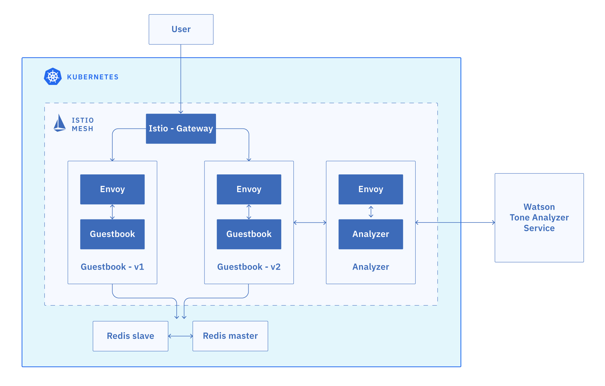

# Exercise 5 - Expose the service mesh with the Istio Ingress Gateway

The components deployed on the service mesh by default are not exposed outside the cluster. External access to individual services so far has been provided by creating an external load balancer or node port on each service.

An Ingress Gateway resource can be created to allow external requests through the Istio Ingress Gateway to the backing services.



## Expose the Guestbook app with Ingress Gateway

1. Configure the guestbook default route with the Istio Ingress Gateway. The `guestbook-gateway.yaml` file is in this repository (istio101) in the `workshop/plans` directory.

```shell
cd ../../plans
kubectl create -f guestbook-gateway.yaml
```

1. Get the **EXTERNAL-IP** of the Istio Ingress Gateway.

```shell
kubectl get service istio-ingressgateway -n istio-system
```

Output:

```shell
NAME                   TYPE           CLUSTER-IP      EXTERNAL-IP     PORT(S)                                       AGE
istio-ingressgateway   LoadBalancer   172.21.254.53    169.6.1.1       80:31380/TCP,443:31390/TCP,31400:31400/TCP    1m
2d
```

1. Make note of the external IP address that you retrieved in the previous step, as it will be used to access the Guestbook app in later parts of the course. Create an environment variable called $INGRESS_IP with your IP address.

Example:

```shell
export INGRESS_IP=169.6.1.1
```

## Connect Istio Ingress Gateway to the IBM Cloud Kubernetes Service NLB Host Name

NLB host names are the DNS host names you can generate for each IBM Cloud Kubernetes deployment exposed with the Network LoadBalancer(NLB) service. These host names come with SSL certificate, the DNS registration, and health checks so you can benefit from them for any deployments that you expose via the NLB on IBM Cloud Kubernetes Service.

You can run the IBM Cloud Kubernetes Service ALB, an API gateway of your choice, an Istio ingress gateway, and an MQTT server in parallel in your IBM Cloud Kubernetes Service cluster. Each one will have its own:

```text
1. Publicly available wildcard host name
2. Wildcard SSL certificate associated with the host name
3. Health checks that you can configure if you use multizone deployments.
```

Let's leverage this feature with Istio ingress gateway:

1. Let's first check if you have any NLB host names for your cluster:

    ```shell
    ibmcloud ks nlb-dnss --cluster $MYCLUSTER
    ```

   If you haven't used this feature before, you will get an empty list.

1. Obtain the Istio ingress gateway's external IP. Get the EXTERNAL-IP of the istio-ingressgateway service via output below:

    ```shell
    kubectl get service istio-ingressgateway -n istio-system
    ```

1. Create the NLB host with the Istio ingress gateway's public IP address:

    ```shell
    ibmcloud ks nlb-dns create classic --cluster $MYCLUSTER --ip $INGRESS_IP
    ```

1. List the NLB host names for your cluster:

    ```shell
    ibmcloud ks nlb-dnss --cluster $MYCLUSTER
    ```

    Example output:

    ```shell
   Retrieving host names, certificates, IPs, and health check monitors for network load balancer (NLB) pods in cluster <cluster_name>...
    OK
    Hostname                                                                             IP(s)               Health Monitor   SSL Cert Status   SSL Cert Secret Name
    mycluster-85f044fc29ce613c264409c04a76c95d-0001.us-east.containers.appdomain.cloud   ["169.1.1.1"]       None             created           mycluster-85f044fc29ce613c264409c04a76c95d-0001
    ```

1. Make note of the NLB host name (<nlb_host_name>), as it will be used to access your Guestbook app in later parts of the course. Create an environment variable for it and test using curl or visit in your browser.

    Example:

    ```shell
    export NLB_HOSTNAME=mycluster-85f044fc29ce613c264409c04a76c95d-0001.us-east.containers.appdomain.cloud
    ```

    ```shell
    curl $NLB_HOSTNAME
    ```

1. Enable health check of the NLB host for Istio ingress gateway:

    ```shell
    ibmcloud ks nlb-dns monitor configure --cluster $MYCLUSTER --nlb-host $NLB_HOSTNAME --type HTTP --description "Istio ingress gateway health check" --path "/healthz/ready" --port 15021 --enable
    ```

1. Monitor the health check of the NLB host for Istio ingress gateway:

    ```shell
    ibmcloud ks nlb-dns monitor status --cluster $MYCLUSTER
    ```

    After waiting for a bit, you should start to see the health monitor's status changed to Enabled.

    Example output:

    ```shell
    Retrieving health check monitor statuses for NLB pods...
    OK
    Hostname                                                                             IP          Health Monitor   H.Monitor Status
    mycluster-85f044fc29ce613c264409c04a76c95d-0001.us-east.containers.appdomain.cloud   169.1.1.1   Enabled          Healthy
    ```

Congratulations! You extended the base Ingress features by providing a DNS entry to the Istio service.

## References

* [Kubernetes Ingress](https://kubernetes.io/docs/concepts/services-networking/ingress/)

* [Istio Ingress](https://istio.io/latest/docs/tasks/traffic-management/ingress/)

* [Bring your own ALB](https://www.ibm.com/blogs/bluemix/2019/04/bring-your-own-alb-dns-with-health-checks-and-ssl-certificates-beta/)

## [Continue to Exercise 6 - Traffic Management](../exercise-6/README.md)
